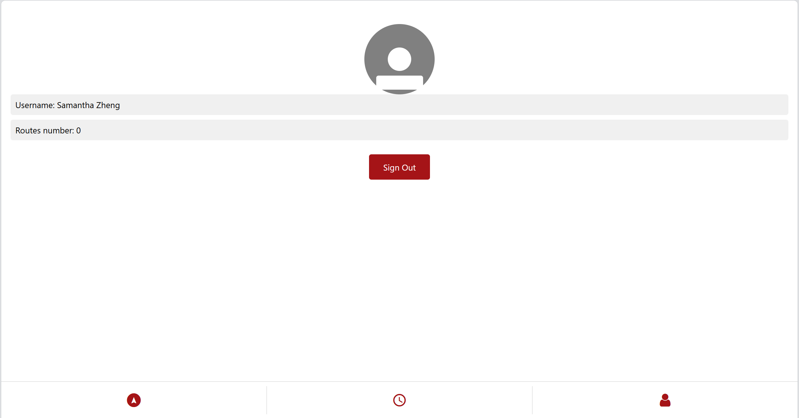
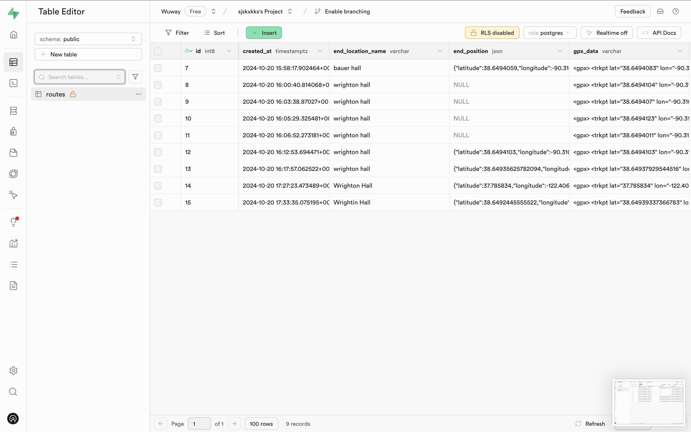
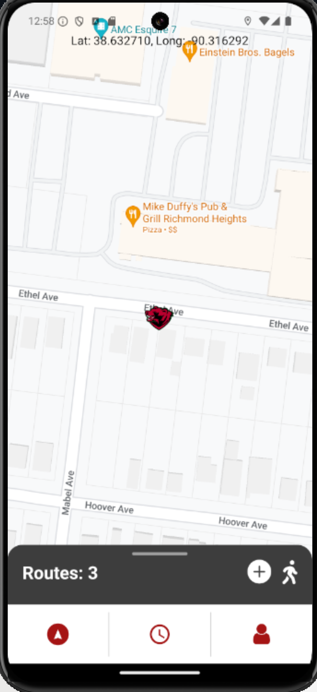
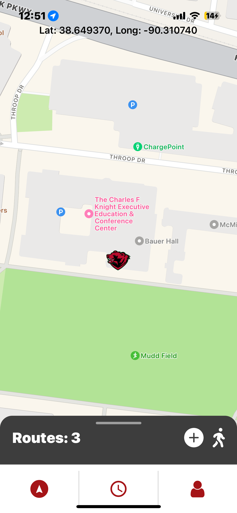

# route-tracker

Description: New to school, Have you ever been confused by campus construction? Regretted going somewhere only to find it overcrowded due to club events? Felt frustrated wasting time walking back and forth between classes? If so, WUWay is here to help!
WUWay is a route-tracking app designed to streamline your campus navigation. It features three main pages. The Main Page prompts you to enter your starting point and destination (e.g., from Simon Hall to Eads Hall). It then recommends the best route based on paths uploaded by other users, all stored securely in a cloud database called Supabase. You can also record and upload your own routes to enhance the recommendations for everyone. Additionally, clubs can log their event locations to notify students, helping you avoid crowded areas.
The Schedule Page allows you to upload and extract your class schedule, storing it by date and time in the cloud database. By selecting today's date, you receive personalized route recommendations tailored to your schedule.
Finally, the Profile Page displays your username and the number of routes you've contributed, along with a sign-out option.
With WUWay, navigating campus has never been easier!
As ambassadors of WashU, we hope you find our app helpful in freeing up time for the things that truly matter—like focusing on your health, wellness, and overall well-being.

### Web Platform

### Android Platform

### IOS Platform

